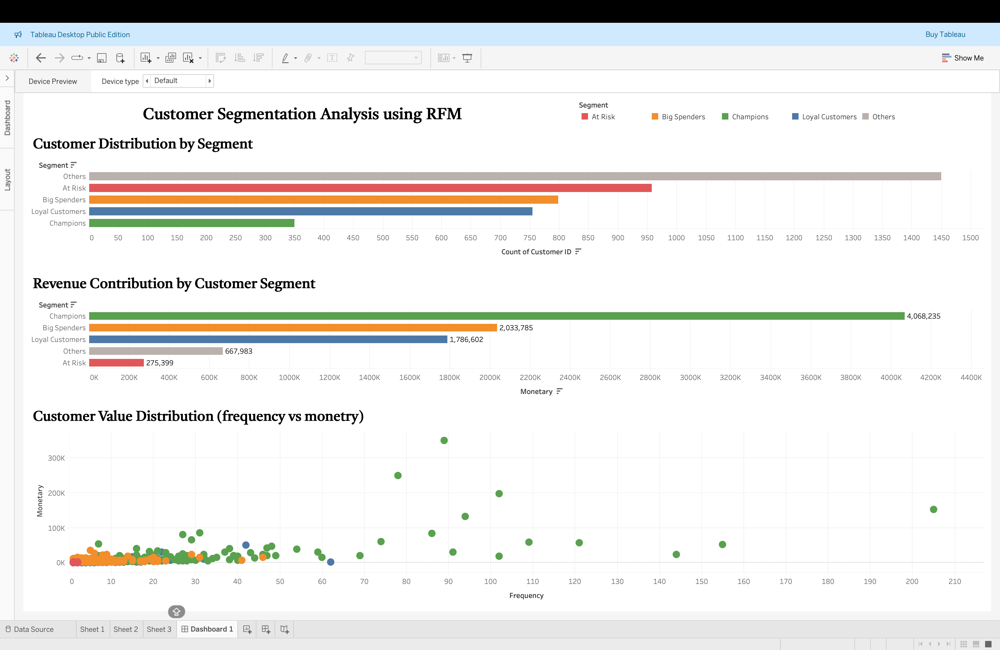

# 📊 Customer Segmentation Analysis using RFM

## 📌 Project Overview
This project performs customer segmentation using the RFM (Recency, Frequency, Monetary) model to identify high-value customers and analyze customer behavior. The analysis is performed using Python and visualized using Tableau.

## 🎯 Objectives
- Segment customers based on purchasing behavior
- Identify high-value and at-risk customers
- Analyze revenue contribution by customer segments
- Provide business insights for retention and growth strategies

## 🛠 Tools & Technologies
- Python (Pandas, NumPy)
- Google Colab
- Tableau Public

## 📂 Dataset
The dataset used is the Online Retail dataset containing transactional data such as:
- Customer ID
- Invoice Date
- Quantity
- Price

## 🔍 Key Steps
1. Data Cleaning
   - Removed missing Customer IDs
   - Removed negative/invalid values
2. Feature Engineering
   - Created TotalPrice column
3. RFM Analysis
   - Calculated Recency, Frequency, Monetary
4. Customer Segmentation
   - Classified customers into segments:
     - Champions
     - Loyal Customers
     - Big Spenders
     - At Risk
     - Others
5. Data Visualization
   - Built interactive dashboard using Tableau

## 📊 Dashboard Insights
- Champions contribute the highest revenue despite being a smaller segment
- A large portion of customers fall under the “At Risk” category
- Majority of customers belong to low-value segments
- High-value customers are identified in the top-right quadrant of the scatter plot

## 📸 Dashboard Preview

## 🚀 Conclusion
The RFM model helps businesses understand customer behavior and enables targeted marketing strategies to improve retention and maximize revenue.

## 👤 Author
Vaishnavi Poojary
